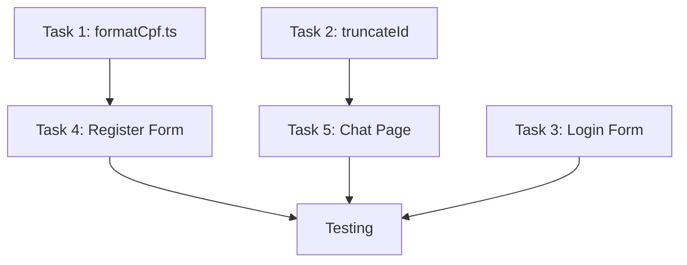

# Implementation Plan: Bug Fixes from Usability Testing

**Branch**: `bug-fixes-01` | **Date**: 2025-01-27 | **Spec**: [Usability Report]  
**Source**: Playwright MCP Browser Testing Session

---

## Summary

This implementation plan addresses **4 usability issues** identified during automated Playwright MCP testing of the login, register, and chat screens:

1. **CPF Input Mask** (High Priority) - Add formatting mask to CPF field
2. **Login Form Validation** (High Priority) - Add error messages for invalid fields
3. **Register Form Validation** (High Priority) - Add error messages for invalid fields  
4. **Conversation ID Display** (Medium Priority) - Truncate long IDs on mobile

**Technical Approach**: Leverage existing `react-hook-form`, `zod`, and `@hookform/resolvers` dependencies for form validation. Create custom CPF formatter utility. Add copy-to-clipboard for conversation ID.

---

## Technical Context

**Language/Version**: TypeScript 5.x, React 19.2.0, Next.js 16.0.4  
**Primary Dependencies**: 
- `react-hook-form@7.66.1` ✅ (installed)
- `zod@4.1.13` ✅ (installed)
- `@hookform/resolvers@5.2.2` ✅ (installed)
- `lucide-react@0.554.0` (for Copy icon)

**Storage**: N/A - Client-side only changes  
**Testing**: Playwright MCP (manual verification)  
**Target Platform**: Web (Desktop + Mobile responsive)  
**Project Type**: Web (Next.js frontend + NestJS backend)  
**Performance Goals**: No regressions; FCP < 1.5s, LCP < 2.5s  
**Constraints**: WCAG 2.1 AA accessibility compliance  
**Scale/Scope**: 3 pages affected, ~200 lines of changes

---

## Constitution Check

*GATE: Evaluated against `.specify/memory/constitution.md`*

| Principle | Status | Notes |
|-----------|--------|-------|
| Library-First | ✅ PASS | Using existing RHF + Zod, no new deps |
| Accessibility-First (WCAG 2.1 AA) | ✅ PASS | Error messages with aria-describedby |
| Design System Consistency | ✅ PASS | Using shadcn/ui Input, text-destructive |
| Performance (Lighthouse >90) | ✅ PASS | No bundle size increase |
| Single Source of Truth | ✅ PASS | Zod schemas define validation |
| YAGNI | ✅ PASS | Minimal implementation, no over-engineering |

**Gate Result**: ✅ All gates passed - proceed with implementation

---

## Project Structure

### Documentation (this feature)

```text
specs/bug-fixes-01/
├── plan.md              # This file (implementation plan)
├── research.md          # Phase 0 output (completed)
├── data-model.md        # Phase 1 output (completed)
├── quickstart.md        # Phase 1 output (completed)
└── tasks.md             # Phase 2 output (completed)
```

### Source Code Changes

```text
client/src/
├── app/
│   ├── login/
│   │   └── page.tsx       # MODIFY: Add RHF + Zod validation
│   ├── register/
│   │   └── page.tsx       # MODIFY: Add RHF + Zod + CPF mask
│   └── chat/
│       └── page.tsx       # MODIFY: Truncate conversation ID
├── lib/
│   ├── formatCpf.ts       # CREATE: CPF formatting utilities
│   └── utils.ts           # MODIFY: Add truncateId function
```

**Structure Decision**: Minimal file changes. Utility functions in `lib/`, validation inline with forms.

---

## Implementation Tasks

### Task 1: Create CPF Formatter Utility (Priority: High)

**File**: `client/src/lib/formatCpf.ts`

**Description**: Create utility functions for CPF formatting

**Functions**:
- `formatCPF(value: string): string` - Apply mask while typing
- `unformatCPF(value: string): string` - Remove mask for API
- `isValidCPFFormat(value: string): boolean` - Validate format

**Acceptance Criteria**:
- [ ] Typing "12345678901" shows "123.456.789-01"
- [ ] Mask applies progressively as user types
- [ ] Only digits 0-9 are accepted
- [ ] Maximum 11 digits (14 chars with mask)

---

### Task 2: Add truncateId to utils (Priority: Medium)

**File**: `client/src/lib/utils.ts`

**Description**: Add function to truncate long IDs for display

**Function**:
```typescript
export function truncateId(id: string, showChars: number = 8): string
```

**Acceptance Criteria**:
- [ ] Long IDs show as "abc12345...xyz67890"
- [ ] Short IDs remain unchanged
- [ ] Default shows 8 chars on each side

---

### Task 3: Refactor Login Form with Validation (Priority: High)

**File**: `client/src/app/login/page.tsx`

**Changes**:
1. Import `useForm` from react-hook-form
2. Import `zodResolver` from @hookform/resolvers/zod
3. Define `loginSchema` with Zod
4. Replace useState with useForm
5. Add error message display below each field
6. Add aria-invalid and aria-describedby for accessibility

**Validation Rules**:
- Email: Required + valid email format
- Password: Required

**Acceptance Criteria**:
- [ ] Empty email shows "Email é obrigatório"
- [ ] Invalid email shows "Email inválido"
- [ ] Empty password shows "Senha é obrigatória"
- [ ] Error messages are red (text-destructive)
- [ ] Screen readers announce errors

---

### Task 4: Refactor Register Form with Validation + CPF Mask (Priority: High)

**File**: `client/src/app/register/page.tsx`

**Changes**:
1. Import `useForm` from react-hook-form
2. Import `zodResolver` from @hookform/resolvers/zod
3. Import `formatCPF`, `unformatCPF` from lib/formatCpf
4. Define `registerSchema` with Zod
5. Replace useState with useForm
6. Add CPF onChange handler with mask
7. Add error message display below each field
8. Strip CPF mask before sending to API

**Validation Rules**:
- Name: Required, min 2 chars
- Email: Required, valid email
- CPF: Required, format xxx.xxx.xxx-xx
- Birthdate: Required
- Phone: Required, min 10 digits
- Password: Required, min 6 chars

**Acceptance Criteria**:
- [ ] CPF field shows mask as user types
- [ ] Each field shows appropriate error message when invalid
- [ ] CPF sent to API without mask (digits only)
- [ ] Form submits only when all validations pass

---

### Task 5: Improve Conversation ID Display in Chat (Priority: Medium)

**File**: `client/src/app/chat/page.tsx`

**Changes**:
1. Import `truncateId` from lib/utils
2. Import `Copy`, `Check` icons from lucide-react
3. Add copy-to-clipboard functionality
4. Display truncated ID with full ID on hover (tooltip)
5. Show success feedback when copied

**Acceptance Criteria**:
- [ ] Long conversation ID displays truncated on mobile
- [ ] Copy button appears next to ID
- [ ] Clicking copy copies full ID to clipboard
- [ ] Visual feedback shows "Copied!" briefly
- [ ] Tooltip shows full ID on hover (desktop)

---

## Implementation Order



**Recommended Order**:
1. Task 1 (formatCpf) - Dependency for Task 4
2. Task 2 (truncateId) - Dependency for Task 5
3. Task 3 (Login) - Independent, quick win
4. Task 4 (Register) - Uses Task 1
5. Task 5 (Chat) - Uses Task 2

---

## Testing Checklist

### Manual Testing (Playwright MCP)

| Test | Page | Expected Result |
|------|------|-----------------|
| Submit empty login form | /login | Show 2 error messages |
| Submit invalid email | /login | Show "Email inválido" |
| Type CPF digits | /register | Show formatted mask |
| Submit empty register form | /register | Show 6 error messages |
| View chat on mobile (375px) | /chat | ID shows truncated |
| Click copy button | /chat | Full ID copied to clipboard |

### Accessibility Testing

- [ ] Error messages have `role="alert"`
- [ ] Invalid fields have `aria-invalid="true"`
- [ ] Error messages linked via `aria-describedby`
- [ ] Focus moves to first error on submit

---

## Rollback Plan

If issues are discovered post-deployment:

1. All changes are in single branch `bug-fixes-01`
2. Revert: `git revert HEAD` or merge revert PR
3. No database changes - instant rollback possible
4. No API changes - backend unaffected

---

## Complexity Tracking

> No constitution violations - all gates passed.

| Aspect | Complexity | Justification |
|--------|------------|---------------|
| New Dependencies | 0 | Using existing packages |
| New Files | 1 | Only formatCpf.ts |
| Modified Files | 4 | login, register, chat, utils |
| Lines Changed | ~200 | Minimal, focused changes |

---

## Next Steps

1. ✅ Phase 0: Research complete (research.md)
2. ✅ Phase 1: Data model complete (data-model.md)
3. ⬜ Phase 1: Create quickstart.md
4. ⬜ Phase 2: Generate tasks.md via `/speckit.tasks`
5. ⬜ Phase 3: Implement changes
6. ⬜ Phase 4: Test with Playwright MCP
7. ⬜ Phase 5: Create PR for review
